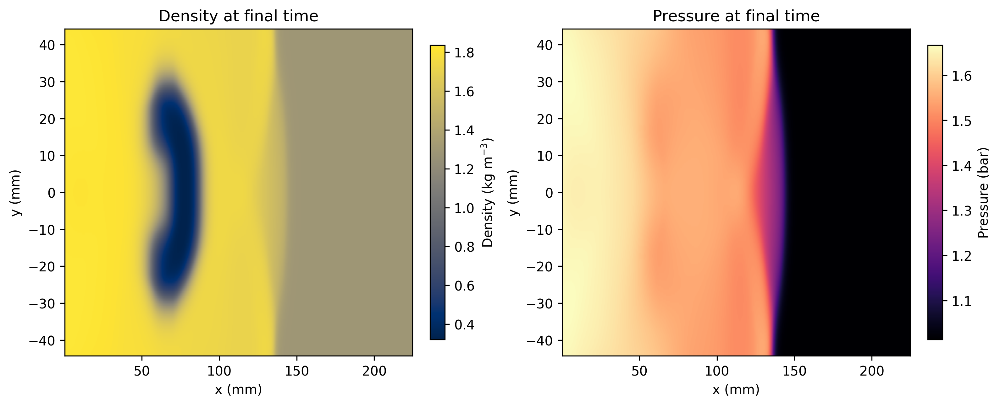
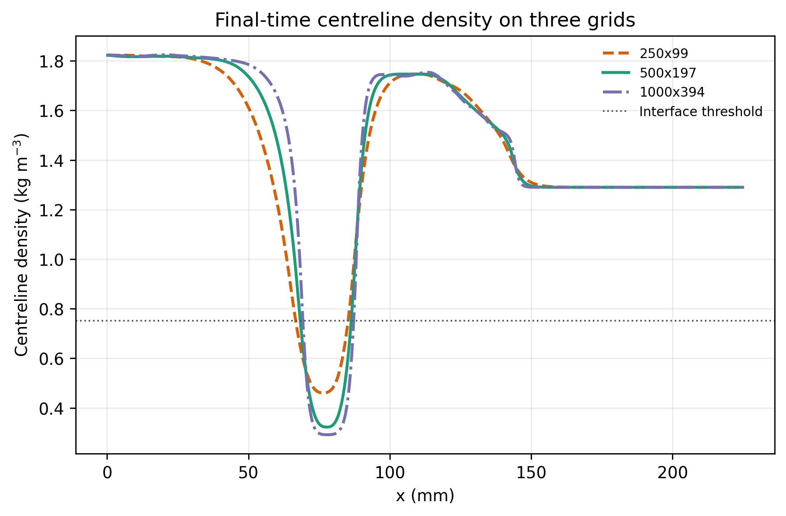
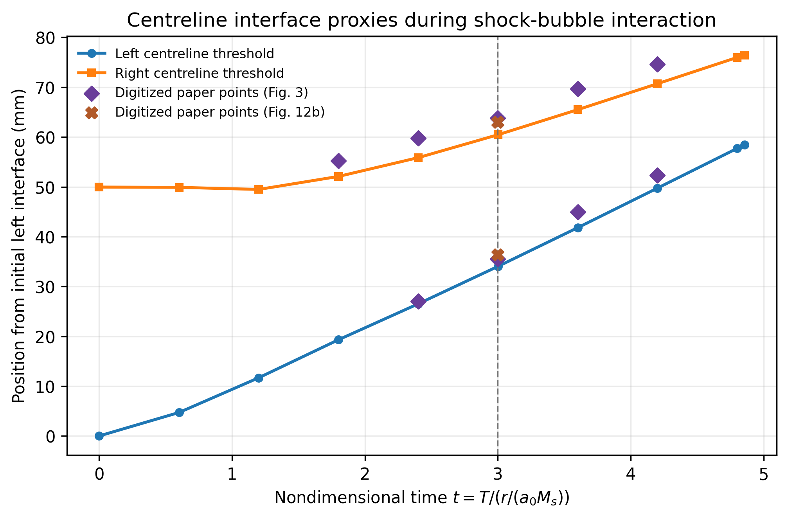

# Performance Optimization of a 2D Euler Shock-Bubble Solver

Single-core C++17 finite-volume solver for the two-dimensional compressible Euler equations, built around a Mach 1.22 shock interacting with a helium bubble. The project combines numerical verification with a controlled performance study of compiler settings, data layout, copying, traversal order, and reconstruction caching.

This public-facing repository keeps the final solver, technical report, reproducibility scripts, report figures, and compact evidence tables.

## Highlights

- Solves the 2D Euler equations with directional splitting, SLIC-type reconstruction, minmod limiting, and FORCE fluxes.
- Runs the full shock-helium-bubble benchmark on a `500 x 197` grid with transmissive boundaries.
- Includes validation checks for planar 1D-in-2D invariance, symmetry, positivity, finiteness, and planar shock plateau states.
- Includes grid-sensitivity and interface-tracking analysis against the Bagabir and Drikakis Mach 1.22 benchmark.
- Measures single-core implementation choices using compile-time variants.

Key results from the final report:

| Result | Value |
| --- | ---: |
| Production grid | `500 x 197` |
| Final physical time | `3.0e-4 s` |
| Baseline production runtime | `20.2 s` on Apple M4 / Apple Clang 17 |
| `std::vector` state-storage slowdown | `~19.1x` |
| Disabling reconstruction cache slowdown | `~1.67x` |
| Density / pressure observed `L1` orders | about `0.6` |

## Visual Results

Production density/pressure/velocity fields:



Grid sensitivity:



Interface tracking against digitized benchmark data:



## Resume Summary

Built and optimized a single-core C++17 finite-volume solver for a 2D compressible Euler shock-bubble benchmark; validated numerical behavior, reproduced key Mach 1.22 morphology from the literature, and quantified implementation-level performance effects including a `~19x` slowdown from dynamic per-cell state storage and a `~1.67x` slowdown from disabling reconstruction caching.

## Repository Layout

```text
.
├── solver.cpp                    # Main C++17 solver
├── Makefile                      # Build and smoke-test targets
├── reproduce_report_data.sh       # Full report-data reproduction workflow
├── scripts/                      # Validation, timing, and analysis scripts
├── inputs/                       # Digitized benchmark comparison points
├── figures/                      # Final report figures
├── reports/                      # Final compact evidence tables/summaries
├── technical_report.pdf          # Final technical report
└── technical_report.tex          # Report source
```

Large raw simulation outputs and intermediate timing logs are intentionally not tracked. They can be regenerated with the scripts.

## Build

Requirements:

- C++17 compiler, tested with Apple Clang 17
- `make`
- Python 3 for validation and post-processing
- Python packages in `requirements.txt` for figure generation

Build the solver:

```bash
make
```

Run a quick smoke test:

```bash
make test
```

The smoke test runs a small planar-shock case and checks `y`-invariance.

## Example Run

```bash
./shock_bubble_solver \
  --case shock-bubble \
  --nx 500 --ny 197 \
  --final-time 3.0e-4 \
  --output-prefix output/default_run
```

Snapshots are written as CSV files with density, pressure, velocity, and metadata columns.

## Full Reproduction

```bash
python3 -m pip install -r requirements.txt
./reproduce_report_data.sh
```

The full workflow rebuilds the solver, reruns the benchmark, regenerates validation summaries and figures, and repeats the timing campaigns used in the report. It is intentionally expensive because it includes the slow `std::vector` state-storage variant.

## Report

The final technical writeup is included as:

- `technical_report.pdf`
- `technical_report.tex`

The main performance evidence is summarized in:

- `reports/compiler_suite_repeated.md`
- `reports/structural_suite_reduced_repeated.md`
- `reports/full_grid_structural_repeated.md`
- `reports/full_grid_vector_repeated.md`

## Notes

Local reference PDFs and private archives are ignored for public GitHub use. The public repository contains only project-owned code, report material, figures, and compact derived evidence.
